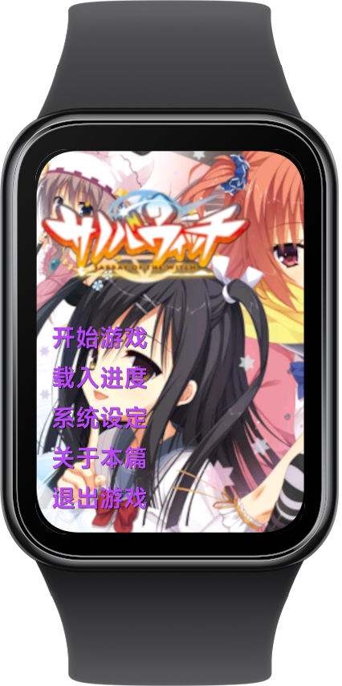
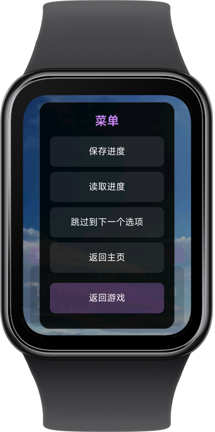
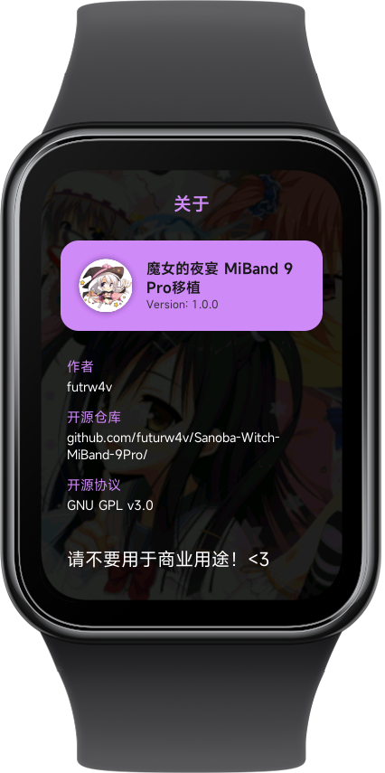

# Sanoba-Witch-MiBand-10

[](https://www.gnu.org/licenses/gpl-3.0.html)


将 [Sanoba-Witch-MiBand-9Pro](https://github.com/futrw4v/Sanoba-Witch-MiBand-9Pro) 移植适配到小米手环 10 的版本。

原版项目为小米手环 9 Pro 开发，本项目针对手环 10 的屏幕尺寸和交互特性进行了适配调整。

## 预览

   

## 已实现功能

- [x] 完整剧本
- [x] UI 交互（适配手环 10 窄屏）
- [x] 背景渲染
- [x] 存档与设置
- [x] 选项与个人线

## TODO

- [ ] 特殊 CG 与鉴赏
- [ ] 人物立绘渲染
- [ ] 隐藏 UI 按钮
- [ ] 快进按钮

## 安装

本项目使用小米 AIoT 开发框架（aiot-toolkit）构建。

### 环境要求

- Node.js >= 8.10
- [aiot-toolkit](https://iot.mi.com/vela/quickapp)

### 开发

```bash
npm install
npm start
```

### 构建

```bash
npm run build
```

### 发布

```bash
npm run release
```

## 剧本转换

项目提供了一个剧本转换工具，位于 `tools/convert_script.py`，用于将原始剧本转换为紧凑的数组格式。

输入文件应为 `.json` 格式，可通过 [FreeMote](https://github.com/UlyssesWu/FreeMote) 中的 `PsbDecompile.exe` 将原始 `.scn` 文件转换为 `.json`。

```bash
python tools/convert_script.py <输入路径> <输出路径>
```

### 剧本数据结构

转换后的文件由一系列数组组成，每个数组的第一个元素为类型标识符：

| 标识符 | 类型 | 数组结构 | 说明 |
| :--- | :--- | :--- | :--- |
| **0** | **节点** | `[0, "label_name"]` | 标签/跳转点 |
| **1** | **背景** | `[1, "bg_name"]` | 背景图片切换 |
| **2** | **对话** | `[2, "说话人", "内容", [立绘列表]]` | 说话人与台词内容，立绘列表可选 |
| **3** | **选项** | `[3, [["文字", "跳转", "表达式"], ...]]` | 分支选项及逻辑判断 |
| **4** | **章节标题** | `[4, "章节标题"]` | 更新剧本章节标题 |

## 项目结构

```
├── src/
│   ├── app.ux                 # 应用入口
│   ├── manifest.json          # 应用配置
│   ├── common/
│   │   ├── bg/                # 背景图片
│   │   ├── scn/               # 剧本数据（.txt）
│   │   ├── constants.js       # 配置常量
│   │   ├── logo.png           # 应用图标
│   │   └── title_bg.png       # 标题背景
│   └── pages/
│       ├── index/             # 主菜单
│       ├── game/              # 游戏引擎
│       ├── data/              # 存档管理
│       ├── settings/          # 系统设置
│       └── about/             # 关于页面
├── tools/
│   └── convert_script.py      # 剧本转换工具
├── screenshots/               # 截图预览
├── LICENSE
└── package.json
```

## 感谢名单

### 原版项目
- [Sanoba-Witch-MiBand-9Pro](https://github.com/futrw4v/Sanoba-Witch-MiBand-9Pro)：原版小米手环 9 Pro 移植

### 游戏内容
- 柚子社（Yuzusoft）：游戏制作
- 暗鸽汉化组：提供原始汉化文本资源

### 技术
- [liuyuze61](https://github.com/liuyuze61)：部分代码与逻辑参考
- Gemini：代码辅助

### 工具
- [GARbro-Mod](https://github.com/crskycode/GARbro) & [FreeMote](https://github.com/UlyssesWu/FreeMote)：资源转换
- [KrkrExtract](https://github.com/xmoezzz/KrkrExtract)：资源提取
- [FFmpeg](https://ffmpeg.org/)：图片处理

## 免责声明

仓库内的所有源代码、脚本等均以 [GNU General Public License v3.0](https://www.gnu.org/licenses/gpl-3.0.html) 协议开源。

仓库内 `src/common/` 目录下的所有游戏素材版权均归 Yuzusoft 所有。
- 这些资源不属于开源范畴
- 内置资源仅用于技术展示，请勿将其用于任何非法或商业用途
- 请在支持正版的前提下进行研究，若相关权利方认为本项目侵权，请联系删除

## 相关链接

- 原版项目（手环 9 Pro）：[Sanoba-Witch-MiBand-9Pro](https://github.com/futrw4v/Sanoba-Witch-MiBand-9Pro)
- 米坛社区：[BandBBS](https://www.bandbbs.cn/resources/6531/)
